  

  Native Apps für iOS und Android — Swift, SwiftUI, Kotlin, Jetpack Compose.

  
  
  
  
  
  
  
  

  

## Projekte

### GreenBite

Ernährungs-Tracking mit Nachhaltigkeitsbewertung. Barcode scannen, Vital-Score und
CO₂-Bilanz auf einen Blick. Dieselbe App, zweimal nativ gebaut — bewusst ohne
Cross-Platform-Framework, um beide Ökosysteme in ihrer eigenen Sprache zu lernen.

  

| | iOS | Android |
|---|---|---|
| **Persistenz** | SwiftData | Room |
| **Backend** | Firebase | Offline-first, Backend geplant |
| **Architektur** | MVVM | MVVM + Repository Pattern |

Beide Versionen entstehen ticketbasiert mit dokumentierten Architekturentscheidungen.
Die Repositories sind privat — Code und Projektverlauf zeige ich gerne auf Anfrage.

  

## Arbeitsweise

**Architektur** MVVM · Repository Pattern · Single Source of Truth  
**Prozess** Ticketbasiert · Conventional Commits · Architecture Decision Records  
**Qualität** Unit-Tests für Logik-Schichten · stateless/stateful getrennte Composables

  

## Kontakt

